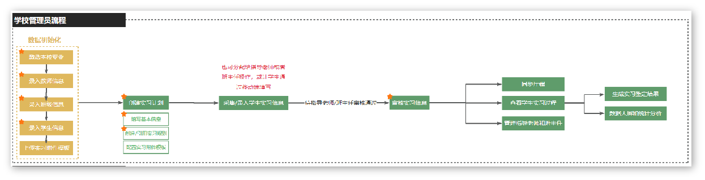
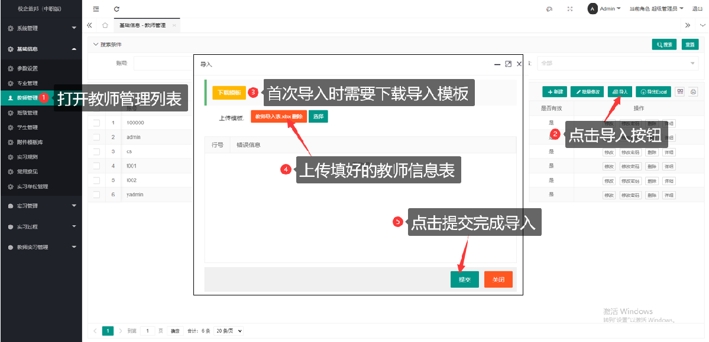
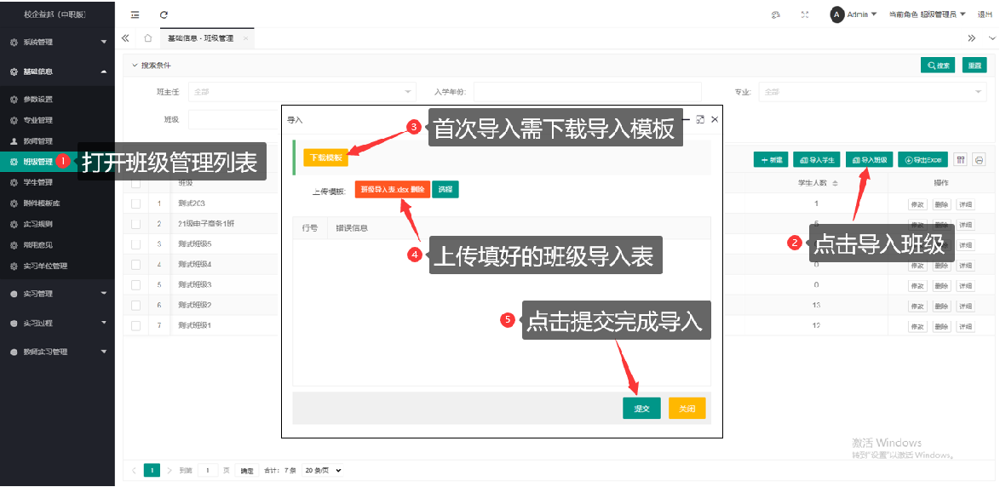
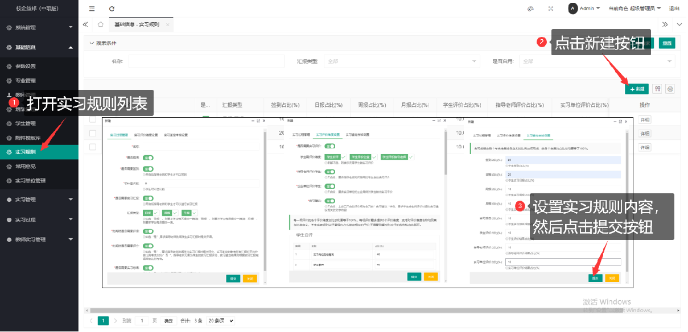
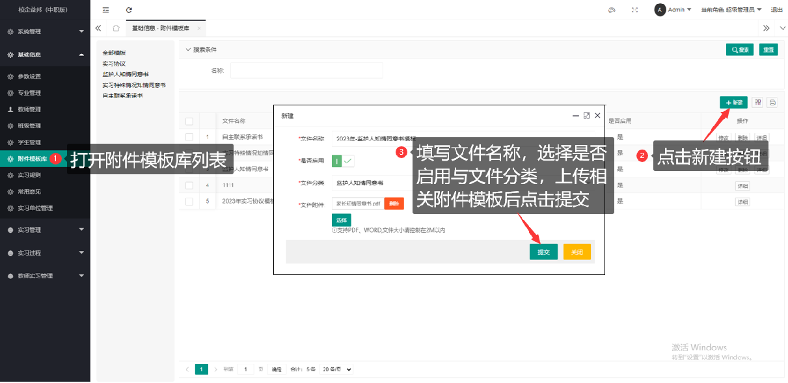
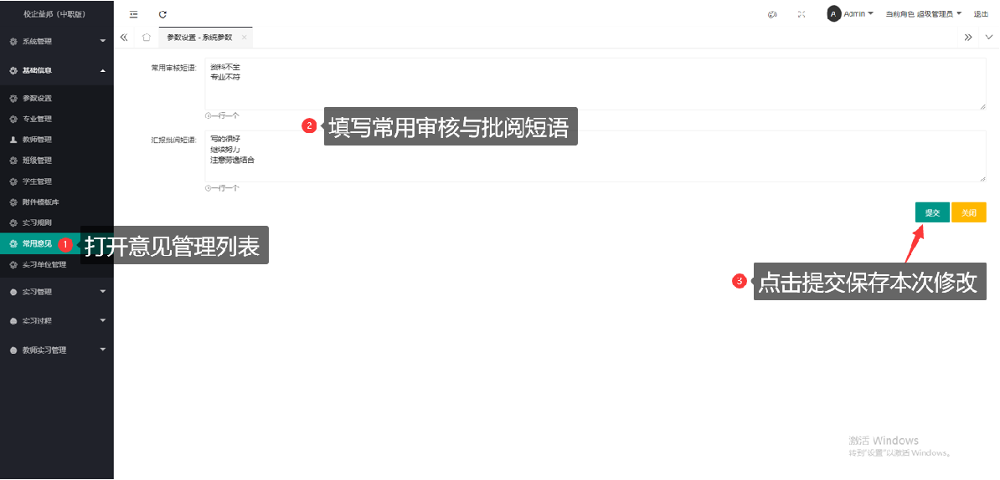
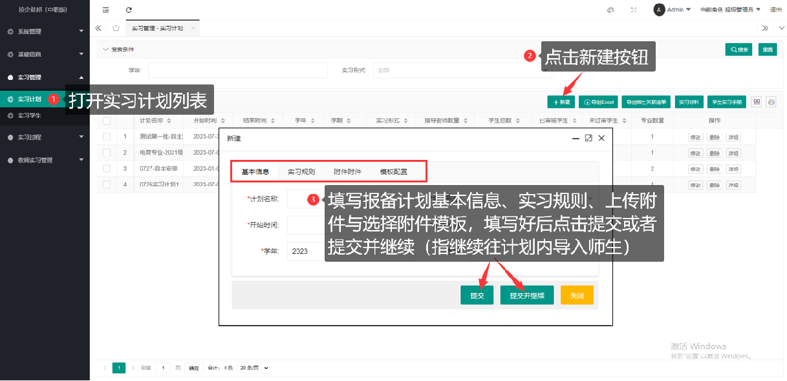
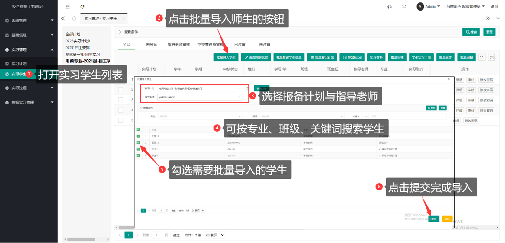

# 一、学校管理员的工作流程是怎么样的

学校管理员拥有系统最高的操作权限。所有操作仅支持在PC端管理后台进行。在整个实习管理流程中，可以进行：数据初始化、制定实习规则、通过实习计划关联学生和指导老师进行实习、修改学生实习信息、对学生实习信息进行最终审核、将实习信息同步至教育厅的实习系统中、查看所有学生的实习过程信息、生成学生实习鉴定结果、管理指导老师和班主任实习管理日志和总结等。

# 二、系统数据初始化都要做什么
## 1.激活专业

温馨提示：系统默认展示的是教育部最新发布的“职业教育专业目录”的专业信息，学校管理员需要先从此目录中选择本校开设的专进行激活，后续新建班级时才能引用本校相关专业；若存在目录外的专业信息，请联系实习管理平台客服进行添加。
## 2.​新建教师

温馨提示：学校管理员必须填写对应厅端账号，后续才能同步学生信息至教育厅实习系统；教师导入表带星号为必填项，若导入表内未填写教师角色，导入后可批量给教师账号设置角色；学校管理员可随时修改教师登录密码及教师账号的有效性。
## 3.新建班级

温馨提示：导入班级时入学日期填写格式为年份-月份-日期，例如：2024-01-01。
## 4.导入学生

温馨提示：导入学生后，系统会自动使用导入的学号生成学生账号，学生初始密码为学号后6位；若一个班级内存在多个专业的学生，在导入学生后，可使用专业变更功能给学生修改专业信息；学生管理列表可随时修改学生的登录密码。
## 5.实习规则

温馨提示：
设置实习规则后，一旦启用该条实习规则，该条实习规则内容则不可修改，后期在学生实习鉴定列表仅可修改学生实习鉴定考核得分占比；其中实习汇报开启评分时，按评分的平均分计算该项得分，不开启则按完成率换算得分。
## 6.附件模板

温馨提示：该功能为非必用功能，添加的附件模板可在学校新建实习计划时使用，学校新建计划选择对应的附件模板后，该计划内的学生在实习报名的实习的附件页面可下载对应的附件模板至学生邮箱；实习附件模板类型包括：实习协议、监护人知情同意书、实习特殊情况知情同意书与自主联系承诺书。
## 7.常用意见

温馨提示：该功能为非必用功能，用于学校管理员在批阅教师提交的日志、汇报与巡查报告时，可在备注栏下拉选择设置的批阅短语
# 二、如何新建一个实习计划？

温馨提示：在新建报备计划时，附件文件与模板配置可忽略使用，忽略使用不影响整体报备流程；有提前评价需求的，可随时开启评价功能，建议在实习结束前开启即可
# 三、如何在计划中导入学生和老师

温馨提示：一个学生处于在岗状态的情况下不会同时存在两个计划中
# 四、如何填写和修改学生实习信息
打开【实习管理】下的【实习学生】列表，找到未报名与学校管理员可审核的学生，勾选学生信息后，点击“批量修改学生信息”

温馨提示：批量修改学生信息时，当某项信息填了才会更新相关内容，为空则不修改；没有更换实习计划需求时，实习计划不用填；实习地区的填写规范为省份全称+城市名，企业名称与信用代码必须与天眼查显示的结果一致才能核查通过
# 五、如何配置附件模板
打开【实习管理】下的【实习计划】列表，找到需要配置附件模板的计划，点击修改按钮，找到模板配置栏，选择对应的模板后提交设置（温馨提示：配置附件为空时不更新已有附件，配置新附件模板则会覆盖原有的配置）

# 六、如何审核学生实习信息和附件
打开【实习管理】下的【实习学生】列表，找到学校管理员审核的那栏，可对单个学生或多个学生进行审核；审核学生时，学生的企业信息通过系统核验后方可进行审核

![Alt text]
# 七、学生实习信息已经过审，但还有修改需求，怎么办
打开【实习管理】下的【实习学生】列表，勾选需要修改的学生信息，然后点击批量回撤按钮；回撤学生信息后，进入学校待审核的列表查找学生，直接点击修改按钮，可修改学生的一切报备信息，勾选学生后点击批量修改按钮，仅可修改学生的实习信息（基础信息与附件信息除外）

# 八、学生通过移动端误点了实习变更，导致学生无法进行正常实习操作，要怎么办
打开【实习管理】下的【实习学生】列表，勾选需要撤销实习变更的学生信息，然后点击撤销实习变更按钮；撤销后，学生会恢复申请实习变更之前的状态

# 九、如何将学生实习数据同步到厅端
打开【实习管理】下的【实习学生】列表，找到学校已过审且为在岗状态的学生信息，勾选需要同步到教育厅系统的学生，然后点击批量同步按钮；同步时，需要选择符合学生实习形式、省区信息以及实习周期的报备计划，若同步的学生较多则需要等待一段时间才能完成同步，若同步失败，系统会显示同步失败的具体原因，可根据失败原因去修改对应的报备信息；学生信息的同步时间与结果可在该列表内查看

# 十、如何查看厅端同步进度
打开【实习管理】下的【实习学生】列表，滑动底部的移动条，找到最新同步时间与最新同步结果查看学生信息的同步进度

# 十一、学生被教育厅打回如何处理
学生被教育厅退回后，学校管理员需要在校端回撤学生信息，然后批量修改学生信息（步骤请参考【七、学生实习信息已经过审，但还有修改需求，怎么办】）；也可将学生重审为不通过退回给学生/指导老师修改，退回给学生/指导老师修改后重新走一遍审核流程与信息同步的流程即可
# 十二、如何变更学生的指导老师
 打开【实习管理】下的【实习学生】列表，勾选需要更换指导老师的学生，点击设置指导老师按钮给学生更换指导老师即可
 
# 十三、如何给学生换实习计划
## 1.只更换学生报备计划，实习信息不修改
打开【实习管理】下的【实习学生】列表，找到学校待审核的学生，勾选需要更换报备计划的学生，点击修改学生信息按钮给学生更换报备计划；在批量修改学生信息的实习计划栏选择需要更换的报备计划，点击保存即可
   ![Alt text]
## 2.更换学生报备计划，同时清除学生报备信息
打开【实习管理】下的【实习学生】列表，找到非过审的学生，勾选需要更换报备计划的学生，点击批量移出计划按钮将学生从原来的报备计划中移出，移除后学生的实习信息将被清空，此时给学生更换报备计划则需要将学生重新导入到新的报备计划内，点击批量导入学生按钮，选择新的报备计划，将刚才被移出计划的学生导入新的报备计划内

# 十四、如何导出学生实习数据
## 1.导出学生实习信息名单
打开【实习管理】下的【实习学生】列表，点击导出Excel按钮可导出列表内的学生实习信息名单

## 2.导出学生实习附件材料
打开【实习管理】下的【实习计划】列表，勾选报备计划，点击实习材料按钮，弹出下载窗口时点击立即生成压缩包，等待一段时间后点击刷新按钮（等待期间可关闭窗口），压缩包生成后会显示生成时间与下载按钮，点击下载导出学生实习附件材料

# 十五、如何查看学生的签到记录和补签记录
打开【实习过程】下的【签到记录】列表，可以查看学生的签到记录、补签记录以及补签审核情况，点击导出Excel按钮可导出学生签到记录

# 十六、如何查看未签到学生名单
打开【实习过程】下的【未签到学生】列表，可以查看当天或以往某天学生未签到情况，当学生连续未签超过3天，学生姓名会标红，点击导出Excel按钮可导出未签到学生名单

# 十七、如何查看学生提交的日报、周报、月报信息
打开【实习过程】下的【实习汇报】列表，可按汇报类型、批阅状态等搜索条件来查看学生的实习汇报，点击导出Excel按钮可导出学生的实习汇报

# 十八、如何查看已被推优的学生周报
## 1.PC端查看步骤
打开【实习过程】下的【实习汇报】列表，是否推优的搜索框选择为“是”，然后点击搜索，查看推优的实习学生汇报，点击导出Excel按钮可导出推优的实习汇报

## 2.移动端查看步骤
教师登录移动端，点击推优报告，进入列表查看推优的实习学生汇报

# 十九、如何查看指导老师评价学生的情况
打开【实习过程】下的【实习评价】列表，点击“已评价”，查看指导老师评价学生的情况，点击“详细”按钮可查看指导老师各项评价维度得分以及评语内容，点击导出Excel按钮可导出实习学生评价列表

# 二十、如何查看学生提交的实习总结信息
打开【学生实习总结】列表，点击“待批阅”或“已批阅”的列表，可查看学生已提交的实习总结，点击“详细”按钮，查看学生实习总结内容，点击导出按钮，可导出学生实习总结数据

# 二十一、如何查看学生自评、企业评价、签到得分、日报周报月报总得分、实习鉴定总分情况
## 1.如何查看学生自评
## 2.如何查看企业评价
## 3.如何查看学生签到、日报、周报及月报总得分

## 4.如何查看学生实习鉴定总分
打开【实习鉴定】列表，滑动底部的滚动条，可以看到学生的实际总分，该列显示的分数为学生实习鉴定的总分，点击导出按钮，可导出学生实习鉴定数据

# 二十二、如何查看学生提交的工资信息
打开【学生工资单】列表，可按月份查看学生的工资单数据，勾选学生后，点击批量删除可将学生的工资单进行删除，点击导出按钮可导出学生的工资单数据

# 二十三、如何查看都有哪些学生未提交工资单
打开【学生工资单】列表，选择当月未提交，可查询本月未提交工资单的学生名单，点击导出按钮可导出未提交的学生名单

# 二十四、如何调整学校学生实习鉴定总分的评分比例
打开【实习鉴定】列表，点击“鉴定得分生成”，然后选择需要修改鉴定得分比例的报备计划。每次修改时，该页面总是默认展示实习规则中的比例，修改完成后，确保合计比例为100%然后点击提交并生成

# 二十五、如何调整学生实习鉴定的总分
打开【实习鉴定】列表，找到需要修改鉴定总分的学生，点击修改，在实际总分栏输入学生的分数，视情况填写相关备注，然后提交设置。
温馨提示：参考总分是系统根据评分规则自动计算的，实习总分默认等于参考总分，但可修改；调整总分时可在备注中填写调分原由；再次生成学生鉴定分时，修改过的实际总分总是会被最新的参考总分覆盖。建议无需再次生成鉴定分时，再去调整学生总分。

# 二十六、如何给学生设定离职
打开【实习学生管理】列表，点击“变更状态”按钮，在学生状态栏将学生改为离职状态，并填写相关的变更原因与实际结束时间，然后提交设置

# 二十七、如何给学生变更实习单位
打开【实习学生管理】列表，筛选离职或转岗状态的学生，勾选学生信息后点击批量转岗变更按钮，填写学生变更后的实习单位信息，点击提交即可完成变更

# 二十八、学生原来是统一安排的实习，现在想要自主实习，怎么处理
### （1）学生未去统一安排的企业实习
打开【实习学生】列表，勾选学生，然后点击批量移出计划的按钮，将学生实习删除信息后重新导入自主实习的计划内给学生报备即可

### （2）学生已去统一安排的企业实习，离职后改为自主实习
打开【实习学生管理】列表，点击“变更状态”按钮，在学生状态栏将学生改为离职状态，并填写相关的变更原因与实际结束时间，然后提交设置；设置学生为离职后，可把学生导入到自主实习的计划内给学生再次报备

# 二十九、针对学校老师的管理功能都有哪些
## 1.指导老师
### （1）驻场签到设置
打开【教师实习管理】下的【指导老师】列表，找到需要设置考勤的驻场教师，点击设置、设置时，是否驻场必须勾选为“是”，并填写驻场的企业名称与地址，驻场教师的考勤补签次数、最少签到次数与签到范围可根据管理需求进行修改

### （2）签到管理
打开【驻场教师签到】列表，可查看驻场教师的签到记录，点击导出按钮，可导出驻场教师签到记录

### （3）实习管理日志
打开【教师实习日志】列表，可查看指导老师提交的日志，点击详细按钮，查看日志详细内容（包括实习企业基础信息、管理学生人数、学生签到、汇报、请假的人数以及到岗情况与特殊情况等），点击导出按钮，可导出指导老师的实习日志数据

### （4）实习总结
打开【教师实习总结】列表，可查看教师提交的实习总结记录，点击详细按钮查看教师实习总结的内容，点击导出按钮可导出教师提交的实习总结数据

## 2.班主任
### （1）实习管理日志
打开【班主任实习日志】列表，可查看班主任提交的日志，点击详细按钮，查看日志详细内容（包括实习企业基础信息、班级学生人数、学生签到、汇报、请假的人数以及到岗情况与特殊情况等），点击导出按钮，可导出班主任的实习日志数据

### （2）实习总结
# 三十、如何为学生修改密码
打开【学生管理】列表，找到需要修改密码的学生，点击修改密码的按钮，输入学生新的密码然后提交即可

# 三十一、如何让学生、指导老师在实习结束前就进行实习评价
打开【实习计划】列表，可按计划开启提前评价的功能，点击修改按钮，把是否开启实习评价勾选为“是”，然后提交设置

# 三十二、如何查看学生都去哪些实习单位实习
打开【实习单位管理】列表，当学生的实习信息经学校过审后，那么对应的实习单位信息会记录到该列表内，如果实习单位管理模块中还没有相关企业信息，那系统会自动生成一条实习单位信息，当企业信息有误时，校管理员可点击修改按钮进行修改，点击导出按钮可导出企业信息数据

# 三十三、如何给驻场老师设置签到位置
打开【教师实习管理】下的【指导老师】列表，找到需要设置考勤的驻场教师，点击设置、设置时，是否驻场必须勾选为“是”，并填写驻场的企业名称与地址，驻场教师的考勤补签次数、最少签到次数与签到范围可根据管理需求进行修改

# 三十四、如何审核并查看驻场老师的签到、补签
打开【驻场教师签到】列表，可查看驻场教师的签到记录，点击导出按钮，可导出驻场教师签到记录

# 三十五、如何建巡查报告
打开【实习巡查】列表，点击新建按钮，填写巡查报告内容，然后提交。温馨提示：巡查报告创建后，只有校层面的老师可查看，不对普通老师公开

# 三十六、如何查看学生账号密码
打开【学生管理】列表，查看学生的账号信息，学生默认密码为账号后6位，若学生忘记密码，可点击修改密码按钮给学生修改登录密码

# 三十七、学生学号错了怎么办
打开【学生管理】列表，找到学号有误的学生，点击修改按钮，输入学生正确的学号信息然后提交设置。温馨提示：系统仅支持修改学生的学号，账号信息不能修改，修改学生的学号后，账号信息不变

# 三十八、如何为老师修改密码
打开【教师管理】列表，点击修改密码按钮，修改教师的登录密码

# 三十九、如何为老师修改角色
打开【教师管理】列表，点击修改按钮可修改单个教师的角色，可批量勾选教师信息，点击批量修改教师角色可以给多个教师同时修改角色，在修改页面勾选对应的角色即可。温馨提示：修改教师角色时，保存后是覆盖的形式，若需要给教师增加角色，需要把之前的角色也一同进行勾选

# 四十、如何设置常用意见
打开常用意见列表，按住回车键，输入常用审核意见（一行只能输入一个），然后提交设置

# 四十一、如何查看统计分析
## 1.数据大屏
点击数据大屏，可按年度查看本校学校学生的实习总人数、各实习状态人数、学生签到率、实习生分布地图、学生薪资情况及学生人数排名前十的实习单位等数据

## 2.如何查看学生的当前实习状态/如何查看离职、在岗学生名单
打开【学生状态总览】列表，可查看学生的当前状态，在搜索框可按在岗、离职、转岗与审核中查看不同状态的学生名单，点击导出按钮可导出对应状态的学生名单

## 3.如何查看各班每天的签到率
打开【班级签到率】列表，可按日期查看班级的签到率，点击导出按钮可导出班级签到率数据
